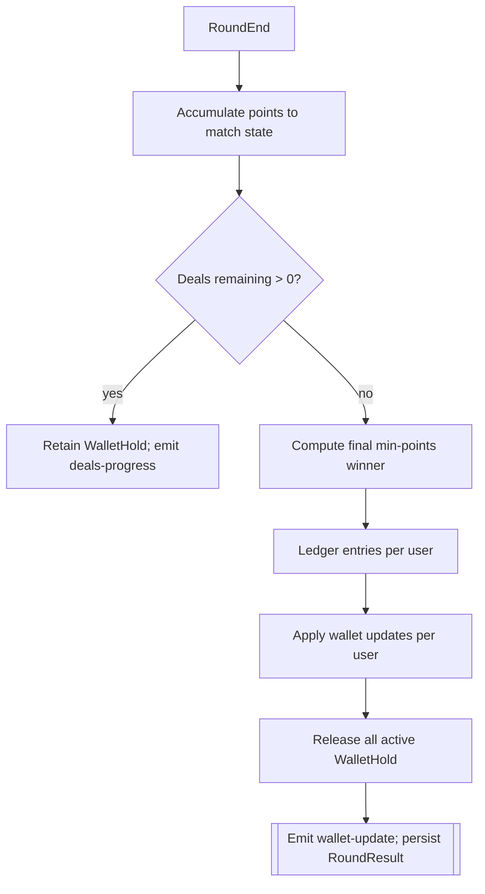
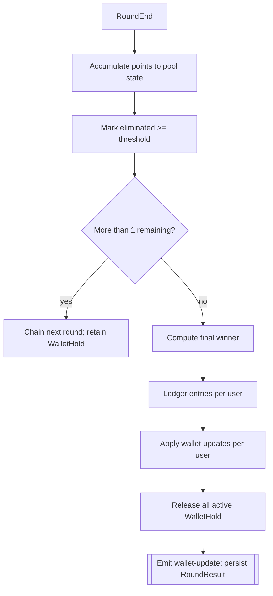
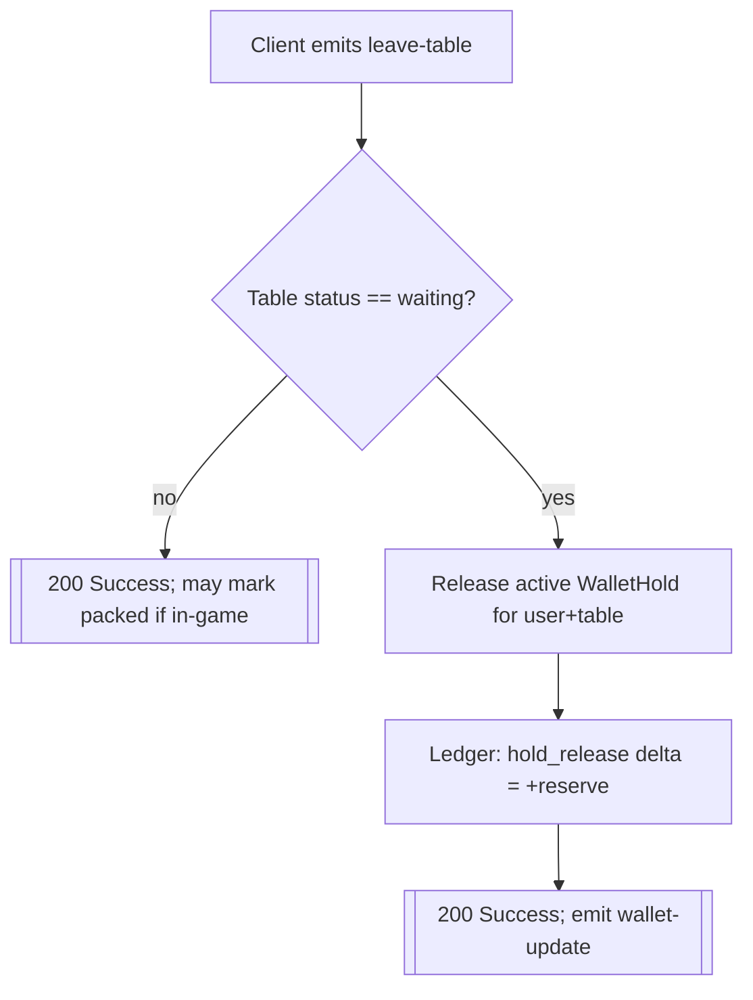

Finance & Holds Lifecycle
=========================

Overview
--------
This document explains how wallet holds are reserved and released across Points, Deals, and Pool tables, and how round settlements affect ledgers and balances.

Join Table (Reserve Hold)
-------------------------

```mermaid
flowchart TD
    A[Client emits join-table { user_id, token, table_id }] --> B{Validate token}
    B -- invalid --> E[[401 Unauthorized]]
    B -- valid --> C[Compute reserveMin via rules]
    C --> D{wallet >= reserveMin?}
    D -- no --> F[[402 Insufficient wallet]]
    D -- yes --> G[Place WalletHold(active=true) amount=reserveMin]
    G --> H[Ledger: hold delta = -reserveMin]
    H --> I[Update user wallet (-reserveMin)]
    I --> J[[200 Success: seat assigned]]
```

Points Rummy: Round End
-----------------------

```mermaid
flowchart TD
    R[RoundEnd] --> P[Compute deltas (points, rake%)]
    P --> L[Ledger entries per user]
    L --> W[Apply wallet updates per user]
    W --> H[Release all active WalletHold for table]
    H --> U[Ledger: hold_release delta = +reserve]
    U --> S[[Emit wallet-update; persist RoundResult]]
```

Deals Rummy: Round End & Match End
----------------------------------



Pool Rummy: Round End & Final Settlement
---------------------------------------



Leave Table (Before Start)
--------------------------



Notes
-----
- Holds are placed only when DB is connected. In-memory/dev runs skip holds but still simulate flows.
- Rake is credited to `RAKE_WALLET_USER_ID` if configured and `RAKE_PERCENT > 0`.
- Ledgering ensures an auditable trail for both round settlements and hold movements.


